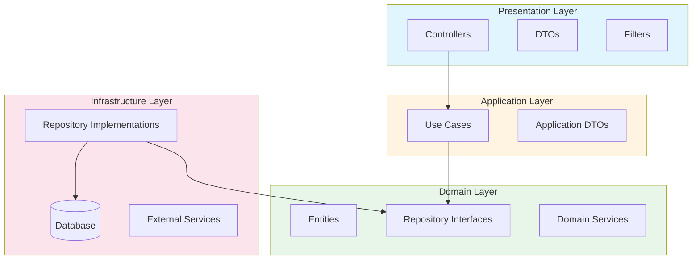
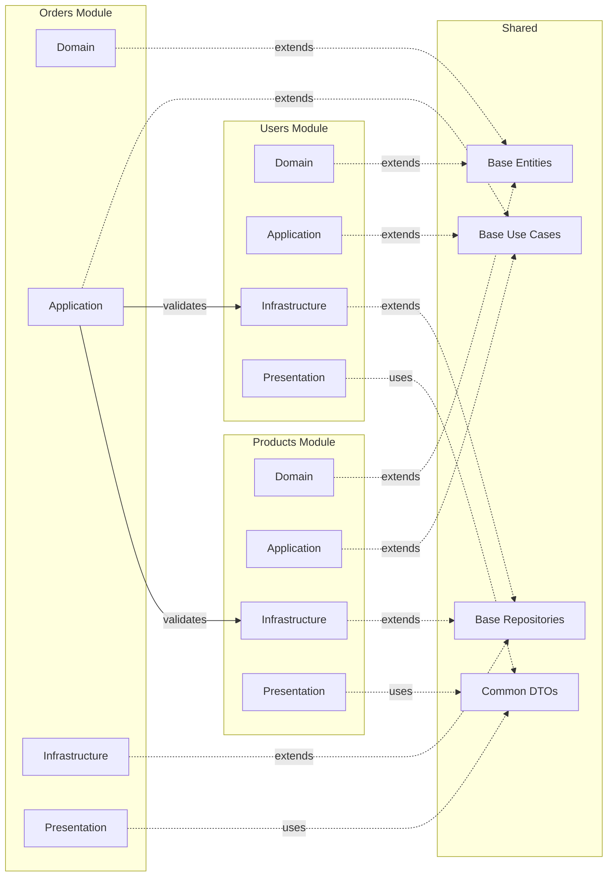
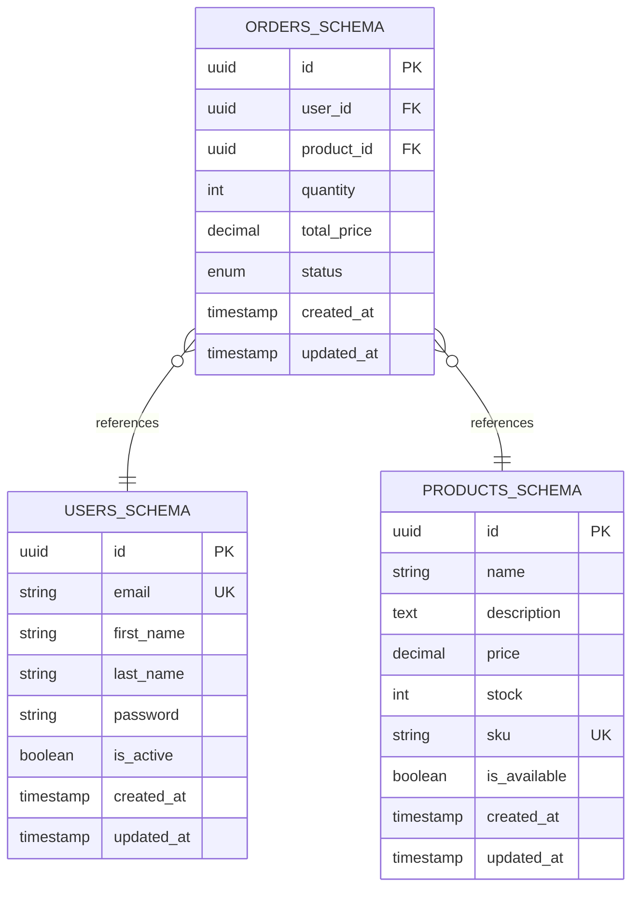
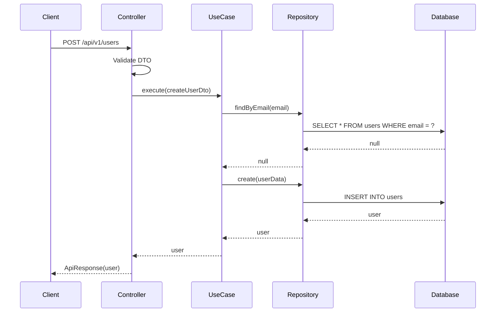
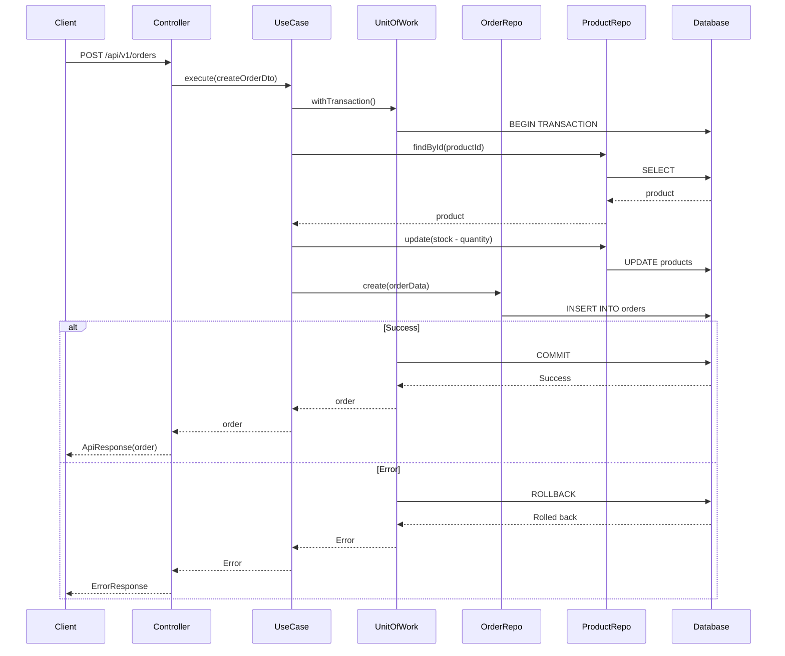
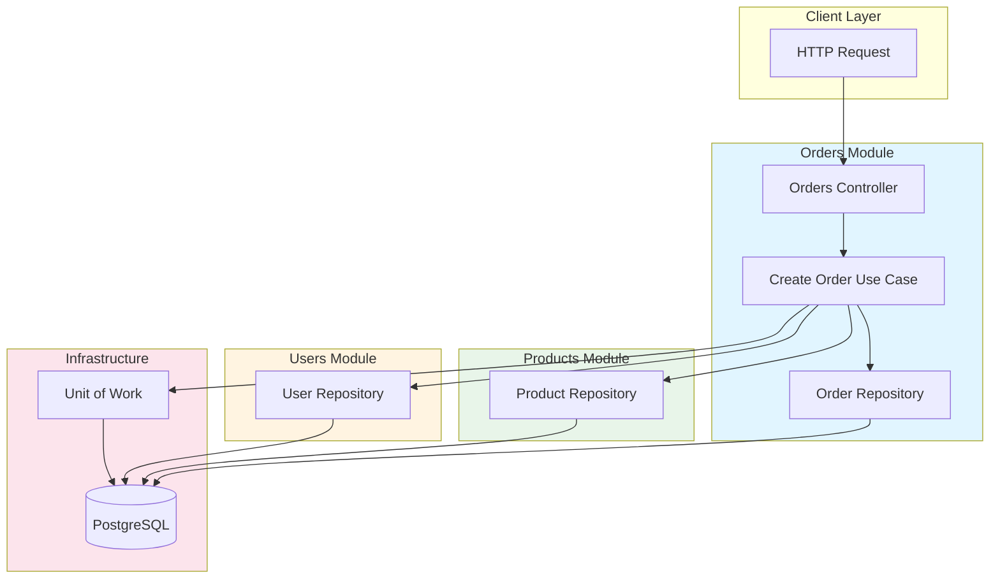
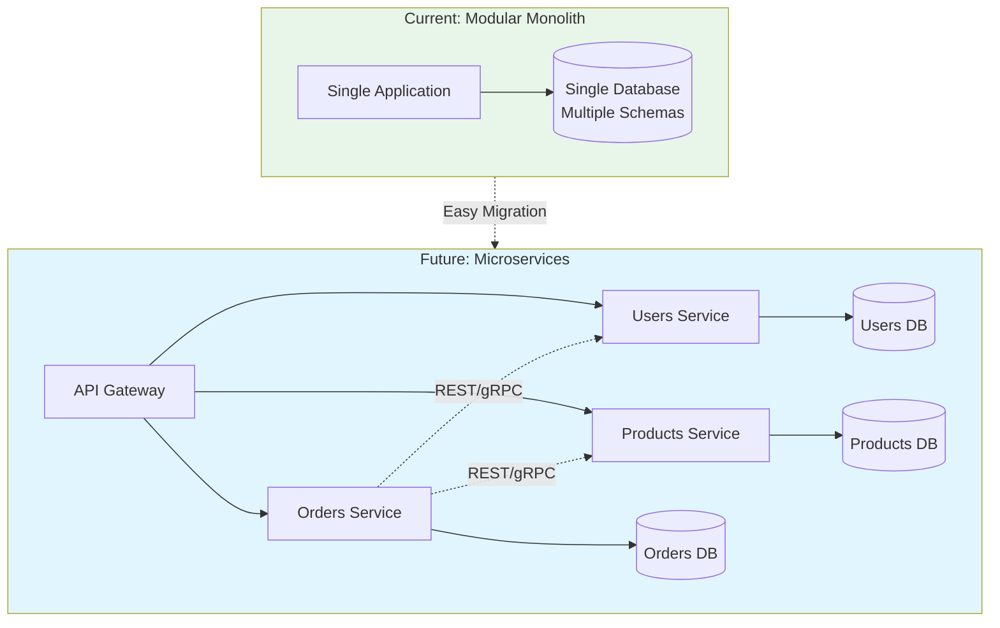
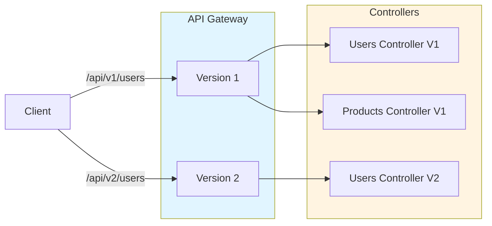

# Architecture Diagrams

## Clean Architecture Layers

## Module Structure

## Database Schemas

## Request Flow

## Transaction Flow (Unit of Work)

## Module Communication

## Deployment Options

## API Versioning

